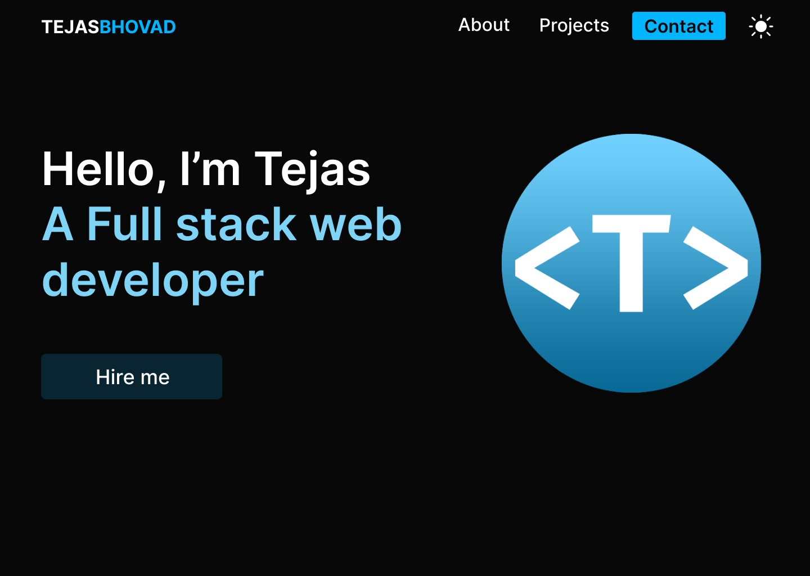

# Portfolio site [ AstroJS ]

> Live: [tejasbhovad.vercel.app](https://tejasbhovad.vercel.app/)

## Design

## Technologies

Took a minimal approach to the design, and used AstroJS to make the site <i>🔥BLAZINGLY FAST</i>
